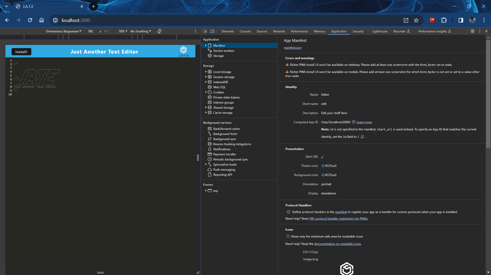

# Text-Editor

## Description

The task is to build a text editor that runs in the browser. The app will be a single-page application that meets the PWA criteria. Additionally, it will feature a number of data persistence techniques that serve as redundancy in case one of the options is not supported by the browser. The application will also function offline.

## Demo

<a href="https://jate-text-editor-fwzd.onrender.com">Deployed App Link</a>

<a href="https://drive.google.com/file/d/1ENb3GHDnWAcMLYvz12Jlnci7SB8uSO1g/view?usp=drive_link">Text Editor Demo Video</a>

### Manifest JSON:

### Service Worker:

### IndexedDB:

## Installation

After you follow the link, press the `install` button. 

If you want to run app locally, clone code and enter the command `npm start` into app's integrated terminal. You may need to run `npm install` before starting to install any dependencies needed for this app to function.

You will need Node.js, express, IndexedDB, webpack, concurrently, @babel, css-loader, and style-loader. All of these can be found at the <a href="https://www.npmjs.com/">npmjs</a> website

## Usage

This application is pretty straightfoward. Enter what you want in the text field, if you click off the application that data will be saved and stored. When you click the install button it will download an extension to your browser allowing you to use the application even when offline.

## Credits

The starter code was provided by Wash U in Saint Louis Coding Bootcamp. I implemented the code to allow the application to work. I authored this code with the help of the bootcamp's coursework, Stack Overflow, and W3Schools. Also, referred to Render documentation to get my application to deploy.

## User Story

As a developer, I want to create notes or code snippets with or without an internet connection so that I can reliably retrieve them for later use.

## Acceptance Criteria

GIVEN a text editor web application

WHEN I open my application in my editor

THEN I should see a client server folder structure

WHEN I run `npm run start` from the root directory

THEN I find that my application should start up the backend and serve the client

WHEN I run the text editor application from my terminal

THEN I find that my JavaScript files have been bundled using webpack

WHEN I run my webpack plugins

THEN I find that I have a generated HTML file, service worker, and a manifest file

WHEN I use next-gen JavaScript in my application

THEN I find that the text editor still functions in the browser without errors

WHEN I open the text editor

THEN I find that IndexedDB has immediately created a database storage

WHEN I enter content and subsequently click off of the DOM window

THEN I find that the content in the text editor has been saved with IndexedDB

WHEN I reopen the text editor after closing it

THEN I find that the content in the text editor has been retrieved from our IndexedDB

WHEN I click on the Install button

THEN I download my web application as an icon on my desktop

WHEN I load my web application

THEN I should have a registered service worker using workbox

WHEN I register a service worker

THEN I should have my static assets pre cached upon loading along with subsequent pages and static assets

WHEN I deploy to Render

THEN I should have proper build scripts for a webpack application

## Contact Me

Email: [devinjl665@gmail.com](mailto:devinjl665@gmail.com?subject=[GitHub]%20Source%20Han%20Sans)